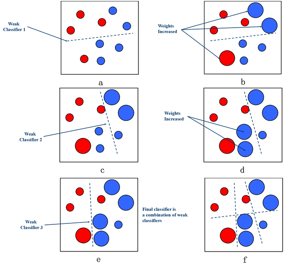
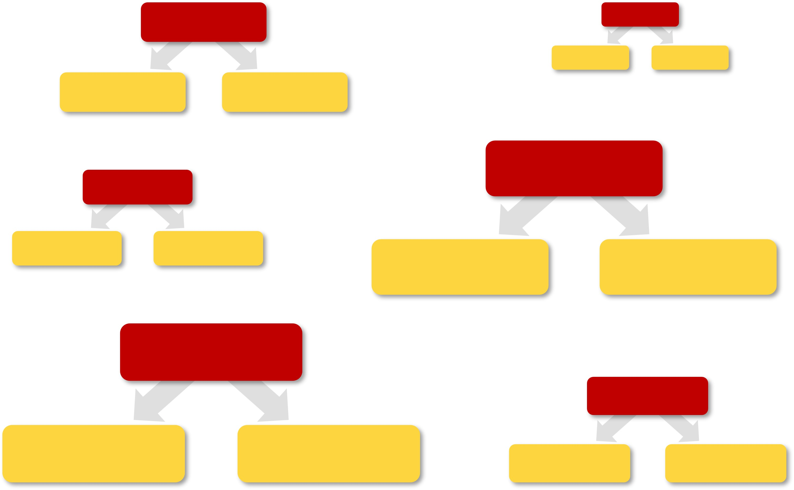
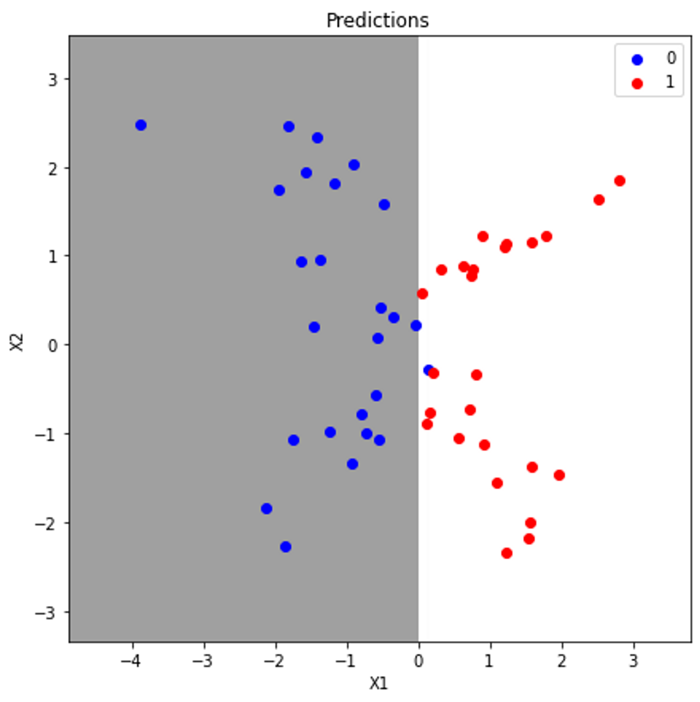
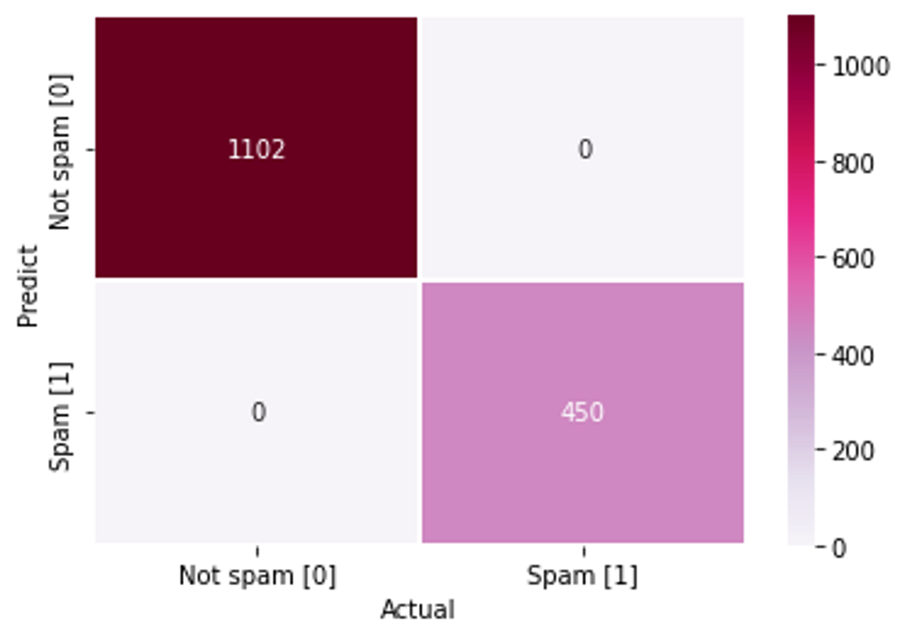
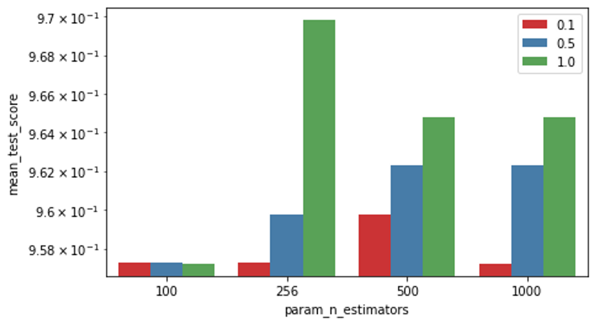
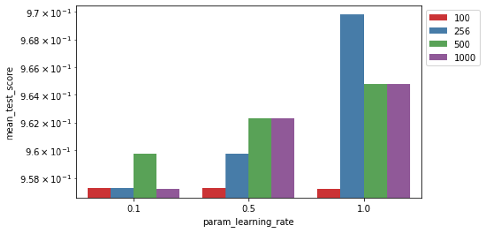

# Business_Analytics_ch4

# **Ensemble Learning**

## 📂 Contents
-----------------------------
* Background
* Steps
* Dataset
* Hyper-parameter search
* Result
* Analysis

### :pushpin: Background 
-----------------------------

* AdaBoost
- classifier의 accuracy를 향상시키기 위해 다수의 weak classifier를 결합시킴 
- weak classifier(learner) : 랜덤 모델에 비해 약간의 성능 향상이 있는 모델 
- 오류 데이터에 가중치를 부여하며 boosting을 수행하는 대표적 알고리즘
- AdaBoost는 다수의 weighted training

    

### :pushpin: Steps 
-----------------------------
* Step 1 : 데이터셋 생성 또는 불러오기
* Step 2 : Model fit (AdaBoostClassifier 생성)
* Step 3 : 결과값 예측
* (Step 4 : 결과 시각화)

### :pushpin: Dataset 
-----------------------------
* make_classification 함수 이용하여 임의의 데이터셋 생성
* Email Spam Classification Dataset (csv) [download](https://www.kaggle.com/datasets/balaka18/email-spam-classification-dataset-csv)
* breast_cancer 

### 🔎 **[심화과정] Hyperparameter Search**
---------
1. **base_estimator** : ensemble을 할 model. 학습에 사용하는 알고리즘
2. **n_estimators** : 생성할 약한 학습기 갯수 지정 (default = 50)
3. **learning_rate** : 학습을 진행할 때마다 적용하는 학습률(0~1)/weak learner가 순차적으로 오류값을 보정해나갈 때 적용하는 계수 (default = 1.0)
4. **random_state** : 실행시 동일한 랜덤 숫자값이 나오도록 설정
  - **max_feature** : 각각의 base estimator에서 추출하는 feature 수

### 🌳 **[심화과정]** Stump tree의 갯수에 따른 성능 변화
-------
* 이번에는 stump tree의 갯수가 달라짐에 따라 어떻게 성능 변화가 일어나는지 살펴보도록 하겠습니다.
> #### stump tree란?
decision tree에서 1개의 node와 2개의 leaf를 가지는 모양을 의미합니다. stump는 1개의 node를 가지기에 오진 하나의 변수만을 사용한다고 볼 수 있으며 _weak learner_ 라고 할 수 있습니다.

    

AdaBoost는 각 트리별 중요도에 있어 차이가 난다는 특징이 있습니다. 하단의 그림을 참고하여 보자면 각 stump의 크기가 다른 것을 확인할 수 있고, boosting의 특징에 따라 이전 stump의 정보를 참고하며 종속적이고 sequential하게 모델을 생성하게 됩니다.

    

### [Result] 
-----------------------------
* make_classification

    

    

* Hyper-parameter search

    

    

* Stump tree의 갯수에 따른 성능 변화

|**Stump**|1|5|10|100|1000|
|:--:|:--:|:--:|:--:|:--:|:--:|
|**Accuracy**|0.895|0.959|0.971|0.982|0.977|

### 📊 Analysis
------------------------------

### 📂 References
------------------------------
* https://github.com/pilsung-kang/Business-Analytics-IME654-
